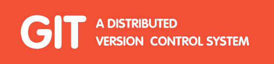

<!---  -->

Browser And NetWork

* [-- 深入了解Chrome浏览器](base/#深入了解Chrome浏览器)
    * [-- 为什么聊Chrome浏览器](base/#为什么聊Chrome浏览器)
    * [-- 什么是多核浏览器](base/#什么是多核浏览器)
    * [-- 浏览器都包含哪些进程](base/#浏览器都包含哪些进程)
    * [-- 浏览器多进程的优点](base/#浏览器多进程的优点)
    * [-- 进程和线程](base/#进程和线程)
    * [-- 单线程和多线程](base/#单线程和多线程)
    * [-- 进程和线程关系特点](base/#进程和线程关系特点)
* [-- 浏览器的前世今生](base/#浏览器的前世今生)
    * [-- 单进程浏览器](base/#单进程浏览器) 
    * [-- 早期多进程浏览器](base/#早期多进程浏览器) 
    * [-- 现阶段多进程浏览器](base/#现阶段多进程浏览器) 
* [-- Chrome的一些Tips](base/#Chrome的一些Tips) 
    * [-- 通过导航查看版本信息](base/#通过导航查看版本信息) 
    * [-- 新版本Chrome的导航变化](base/#新版本Chrome的导航变化) 

Chrome and NetWork

Git Commond

Mine Javascript

More Learning Pathway

Good FrontEnd Framework

<a class="vueLogo" href="https://cn.vuejs.org/" target="_blank">

The Progressive JavaScript Framework

</a>