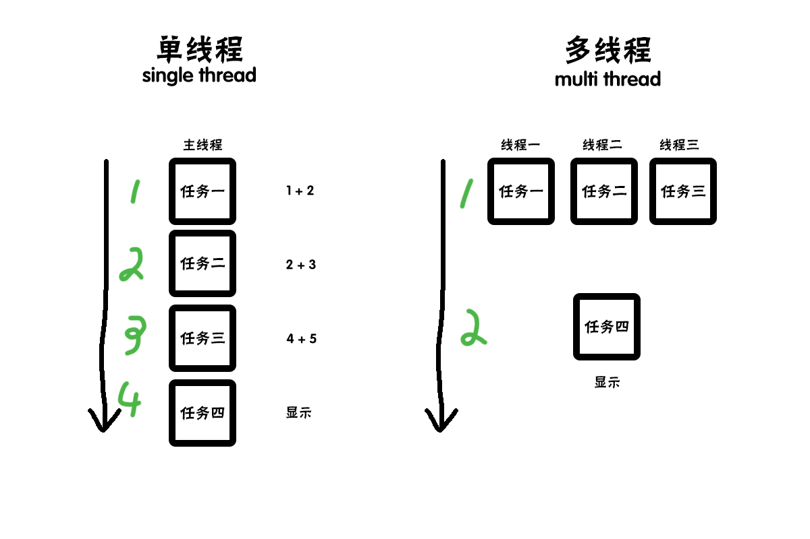
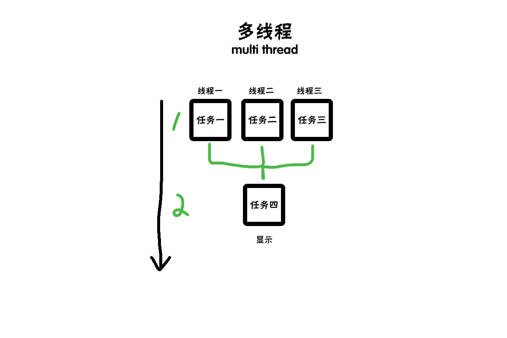

# Chrome-架构理解

<br>

作为前端开发者，我们经常跟浏览器打交道。今天让我们来聊聊 `Chrome` 浏览器。

<br>
<br>

#### 为什么讨论Chrome浏览器

因为市面上大多的浏览器都使用的谷歌的 `Chromium` 来二次开发。而 `chrome` 是官方浏览器。他的特性各方面都与 `chromium` 没有太大的差别；<br><br>
`Chrome` 基于庞大的用户群体，越来越注重开发者体验，控制台的功能不断优化，使得开发者在调试的过程当中越来越方便；<br><br>
讨论，研究 `Chrome` 浏览器的架构概念，能够大大的优化我们的 `web` 应用，提升用户体验。<br>

<br>
<br>

#### 打开一个页面启动多少个进程

打开至少要开启以下进程：
* 浏览器进程
* 网络进程
* 渲染进程
* GPU进程

这四个进程分别是用来做什么的呢？后面我会一一跟大家诠释。接下来，我们先来了解一些 `进程` 和 `线程` 的概念。

<br>
<br>


#### 进程和线程


`进程`是一个应用实例。
操作系统中开启一个应用的时候都会有一个 `进程`（比如说开启 `QQ音乐`），系统会分配一定的内存给到这个进程。

>`Chrome` 比较特殊，它一个标签页就是一个 `进程`。

<br>

`线程` 处于进程下级，是进程的一个执行单元，负责当前进程中的执行。一个进程可以有多个线程，但是至少有一个线程。线程共用进程的内存。

>`线程` 不能单独存在，必须依附在 `进程` 下面，是由 `进程` 管理和启动的。

<br>


`进程` 和 `线程` 的关系如下图:
```
| 操作系统
|   | 进程                  //打开浏览器会有一个进程
|   |   | 线程              //一个线程用来处理 `css`
|   |   | 线程              //一个线程用来处理 `js`
|   |   |   | 栈内存              //存放简单的数据类型
|   |   |   | 堆内存              //存放复杂的数据类型

```
<br>
<br>

#### 单线程和多线程

正常情况下我们会用 `单线程`，通过4步来执行我们的任务：

```copy
a = 1 + 2;              //步骤一，计算 1 + 2;
b = 2 + 3;              //步骤二，计算 2 + 3;
c = 4 + 5;              //步骤三，计算 4 + 5;
                        //步骤四，显示结果；
```


<br>


<br>
<br>

如果采用 `多线程` 并行的方式,通过两步来执行我们的任务：


```copy

      |            |            |
a = 1 + 2;   b = 2 + 3;   c = 4 + 5;              //步骤一，多线程同时计算 4 + 5 、2 + 3、 4 + 5;
                                                  //步骤二，显示结果；
```

<br>
<br>

**我们来画一个示意图：**




>通过上面的示意图，我们可以知道，`多线程` 并行只需要两步，可以高效的执行我们的任务，而 `单线程` 要执行4步。


<br>
<br>

#### 进程和线程之间的关系特点

* **一、任一线程的执行出错都会导致进程奔溃；**
```copy
a = 1 + 2;
b = 2 + ;
c = 4 + 5;
```
>上面的例子中，`b` 等于 `2` 加 `空格` ，任务执行的时候线程会出现错误，导致中断，这样会导致整个进程奔溃。

<br>
<br>

* **二、线程之间共享进程中的数据；**
>上面图中的例子，第一步，每个线程中都会计算出对应的值，第二步，从任意一个线程中直接调用各线程的值并且显示出来。

<br>
<br>

* **三、当一个进程关闭之后，改进程的内存会被系统回收。**
>我们开启一个程序会开启一个进程，这个程序会跟操作系统申请内存。当这个程序关闭的时候，这个内存就会被系统回收（即便这个程序有内存泄露的情况）。<br>
像以前，很多 `IE` 浏览器，在播放视频或者玩游戏的时候，都会提示需要安装插件。这些插件很容易导致内存泄露严重，如果页面打开很多，很容易导致应用程序奔溃。<br>
但是，只要该应用程序或者该页面退出的时候，系统就会回收这些内存。

<br>
<br>

* **四、进程之间的内容相互隔离**
>进程隔离是为了保护每个程序之间不受影响。避免一个程序奔溃之后影响另一个程序。每个进程只能访问自己进程内部的数据，也就避免了数据互相写入的情况。<br>
如果进程之间需要通讯，就需要用到进程通信进制，简称-IPC。

<br>
<br>

## 浏览器的前世今生


我们通过了解浏览器的进化史，通过了解整个发展过程来加深浏览器底层概念的理解。


#### 单进程浏览器


`单进程浏览器` 顾名思义，就是浏览器所有的功能模块都运行在这一个进程里面。这些功能包括网络，插件，js 运行环境，渲染引擎和页面等等。

这就是为什么有以前的浏览器打开网页总会出现不稳定，不流畅，不安全等情况。

下面我们来分析一下这些问题。


<br>
<br>

**不稳定**

早期的视频和游戏运行环境必须依靠插件进行。而插件是最容易出现问题的模块，这就导致页面很容易就奔溃。

再是，以前的浏览器 js 引擎在性能上并不是很好，对于一些复杂的 js 并不能很好的运行，有时候运行起来也吃力。这也很容易导致页面奔溃。

<br><br>

**不流畅**

因为早期的所有模块都是运行在一个程序里面，那就意味同一时刻只有一个模块能运行。

