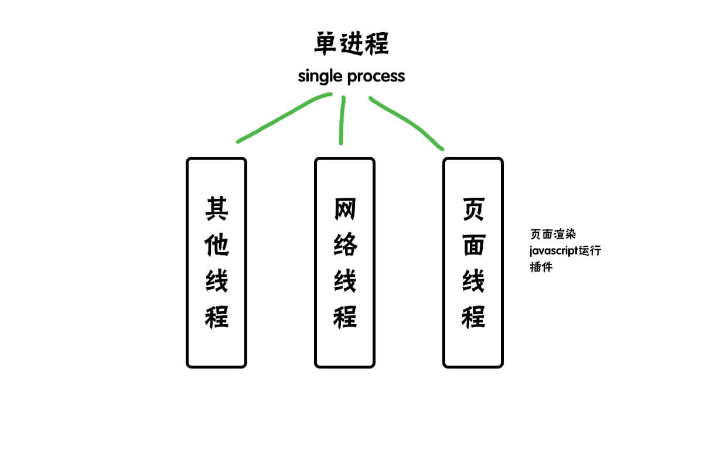

# 深入了解Chrome浏览器

<br>

作为前端开发者，我们经常跟浏览器打交道。今天让我们来聊聊 `Chrome` 浏览器。

以下的内容都是以 `Chrome` 浏览器展开。


<br>
<br>

#### 为什么聊Chrome浏览器

>因为市面上大多的浏览器都使用的谷歌的 `Chromium` 来二次开发。而 `chrome` 是官方浏览器。他的特性各方面都与 `chromium` 没有太大的差别；<br><br>
`Chrome` 基于庞大的用户群体，越来越注重开发者体验，控制台的功能不断优化，使得开发者在调试的过程当中越来越方便；<br><br>
讨论，研究 `Chrome` 浏览器的架构概念，能够大大的优化我们的 `web` 应用，提升用户体验。<br>


<br>
<br>

#### 什么是多核浏览器

>意思为多个内核浏览器。因为 `IE` 浏览器在我们早期在国内盛行，许多银行在交易转账或者支付的时候，仅支持的是 `IE` 内核（Trident），后来大部分浏览器厂商为了兼容这一点，弄了一个 `多核` 浏览器；<br><br>
意思是用户既可以使用 `Trident` 内核进行银行交易转账或者支付，又可以使用 `webkit` 内核来高速浏览页面。所以你可以看到有些浏览器有 `高速模式` ；

<br>
<br>


#### 浏览器多进程的优点
* 避免单个页面奔溃导致浏览器的奔溃；
* 避免插件奔溃导致浏览器的奔溃；
* 方便使用沙盒模式，对插件进行隔离，提高安全性；

<br>
<br>


#### 浏览器都包含哪些进程

一般我们打开一个页面至少要开启以下进程：
* **浏览器进程：**<br>
>浏览器的主进程（负责指挥一切），负责浏览器的界面展示，用户的交互，前进和后退；<br>
负责各个 `tab` 页面的管理，管理子进程，创建和销毁它们；<br>
负责将 `渲染进程` 中的位图绘制到用户界面上来；<br>
网络资源，下载，提供存储功能等等；

<br>


* **网络进程：**<br>
>负责网络的资源加载，之前作为一个模块放在浏览器进程里面，最近被释放成为一个单独的进程；

<br>

* **渲染进程：**<br>
>负责把 `Html` ， `Css` ， `Javascript` 转换成可以让用户看到的和交互的页面。<br>
`排版引擎【Blink】` 和 `Javascript引擎【V8】` 都是在这个进程里面运行；<br>
一般情况下，`Chrome` 都会为每一个 `tab（页面）` 创建一个渲染进程，处于安全考虑，渲染进程被放在沙箱模式下；

<br>

* **GPU进程：**<br>
>刚开始是没有 `GPU` 的这个概念，最开始的初衷是为了 `css3` 的3D效果而实现的，直到后来，大家都用 `GPU` 去做页面绘制，这样使得大部分浏览器都采用 `GPU` ；

<br>

**如果你有插件运行的话，那就有可能会开启浏览器进程**

* **插件进程：**<br>
>负责插件的运行，每个插件都会单独做一个进程，仅在插件使用的时候才会开启一个进程；


<br>
<br>


#### 进程和线程

`进程` 和 `线程` 的关系如下图:
```
| 操作系统
|   | 进程                  //打开浏览器会有一个进程
|   |   | 线程              //一个线程用来处理 `css`
|   |   | 线程              //一个线程用来处理 `js`
|   |   |   | 栈内存              //存放简单的数据类型
|   |   |   | 堆内存              //存放复杂的数据类型

```

<br>

**进程**

`进程`是一个应用实例。
操作系统中开启一个应用的时候都会有一个 `进程`（比如说开启 `QQ音乐`），系统会分配一定的内存给到这个进程。

>`Chrome` 比较特殊，它一个标签页就是一个 `进程`。


<br>

**线程**

`线程` 处于进程下级，是进程的一个执行单元，负责当前进程中的执行。一个进程可以有多个线程，但是至少有一个线程。线程共用进程的内存。

>`线程` 不能单独存在，必须依附在 `进程` 下面，是由 `进程` 管理和启动的。

<br>


<br>
<br>

#### 单线程和多线程

正常情况下我们会用 `单线程`，通过4步来执行我们的任务：

```copy
a = 1 + 2;              //步骤一，计算 1 + 2;
b = 2 + 3;              //步骤二，计算 2 + 3;
c = 4 + 5;              //步骤三，计算 4 + 5;
                        //步骤四，显示结果；
```


<br>


<br>
<br>

如果采用 `多线程` 并行的方式，通过两步来执行我们的任务：


```copy

      |            |            |
a = 1 + 2;   b = 2 + 3;   c = 4 + 5;              //步骤一，多线程同时计算 4 + 5 、2 + 3、 4 + 5;
                                                  //步骤二，显示结果；
```

<br>
<br>

**我们来画一个示意图：**


>通过上面的示意图，我们可以知道，`多线程` 并行只需要两步，可以高效的执行我们的任务，而 `单线程` 要执行4步。


<br>
<br>

#### 进程和线程关系特点

* **一、任一线程的执行出错都会导致进程奔溃；**
```copy
a = 1 + 2;
b = 2 + ;
c = 4 + 5;
```
>上面的例子中，`b` 等于 `2` 加 `空格` ，任务执行的时候线程会出现错误，导致中断，这样会导致整个进程奔溃。

<br>
<br>

* **二、线程之间共享进程中的数据；**
>上面图中的例子，第一步，每个线程中都会计算出对应的值，第二步，从任意一个线程中直接调用各线程的值并且显示出来。

<br>
<br>

* **三、当一个进程关闭之后，该进程的内存会被系统回收。**
>我们开启一个程序会开启一个进程，这个程序会跟操作系统申请内存。当这个程序关闭的时候，这个内存就会被系统回收（即便这个程序有内存泄露的情况）。<br>
像以前，很多 `IE` 浏览器，在播放视频或者玩游戏的时候，都会提示需要安装插件。这些插件很容易导致内存泄露严重，如果页面打开很多，很容易导致应用程序奔溃。<br>
但是，只要该应用程序或者该页面退出的时候，系统就会回收这些内存。

<br>
<br>

* **四、进程之间的内容相互隔离**
>进程隔离是为了保护每个程序之间不受影响。避免一个程序奔溃之后影响另一个程序。每个进程只能访问自己进程内部的数据，也就避免了数据互相写入的情况。<br>
如果进程之间需要通讯，就需要用到进程通信进制，简称-IPC。

<br>
<br>


#### Chrome的进程模型

`Chrome` 一直在宣传说 `one tab one process` ，但是实际上是不是这样呢？<br>

其实不是的。下面我来说明一下`Chrome`的几种进程模型：

`Process-per-site-instance`：意思是从一个网站点击弹出


## 浏览器的前世今生


我们通过了解浏览器的进化史，通过了解整个发展过程来加深浏览器底层概念的理解。

<br>
<br>


#### 单进程浏览器


`单进程浏览器` 顾名思义，就是浏览器所有的功能模块都运行在这一个进程里面。这些功能包括网络请求，js 运行，插件运行，页面渲染等等。



这些功能模块都放在了一个模块里面，是导致浏览器进程不稳定，不流畅，不安全等情况的原因。

下面我们来分析一下这些问题。

<br>
<br>

**不稳定**

早期的视频和游戏运行环境必须依靠插件进行。而插件是最容易出现问题的模块，以为插件是运行在浏览器进程里面的，插件一旦奔溃，这就导致整个浏览器奔溃。

再是，以前的浏览器 js 引擎在性能上并不是很好，对于一些复杂的 js 并不能很好的运行，有时候运行起来也吃力。这也很容易导致页面奔溃。

<br><br>

**不流畅**

因为早期的所有模块都是运行在一个程序里面，那就意味同一时刻只有一个模块能运行。

比如我们有个无线循环的脚本：

```copy
for(var i = 1;i>0;i++){
      console.log(i);
}
```

上面这段脚本是无线循环脚本，意味着执行到这一块的时候永远停留在这里，后面的其他功能模块无法被正常执行。

不流畅还有另外一个因素就是内存泄露。

我们都知道有些脚本插件性能并不是那么好，容易引起内存泄露，内存泄露也是引起单进程处理能力变慢的因素。

运行性能不高的复杂一点的脚本会导致内存泄露，有些内存泄露即便你关掉页面之后也不能完全回收，时间一长，内存占用就越来越高，浏览器就会变的慢。


<br>
<br>

**不安全**

我们以前总是听说密码被盗了，电脑资源被恶意获取了。这是为什么？

以前的浏览器大多因为插件和脚本的关系，容易引起上述的问题出在。

就插件而言，`插件` 可以用 c++/c 语言来编写。那么这样的插件可以很方便的获取你电脑里的资源。当你在运行这个插件的时候，也就意味着有可能会让人操作你的电脑。

`脚本` 的话是根据系统漏洞攻克来取得系统权限。获取权限之后也可以对系统做一系列操作。

<br>
<br>

**往事不堪回首**

**因为 `单进程` 浏览器会有这样的缺点存在。时代在变迁，新一代浏览器已经做出相对应的方案。**


<br><br>

#### 早期多进程浏览器

2008 年 `Chrome` 发布的进程架构。


从上面的图，我们可以看出，插件被单独独立成了一个进程，页面是运行在单独的渲染进程里面，进程之间是通过IPC机制通信。


<br>
<br>

!>早期多进程浏览器解决了单进程浏览器的什么问题?

* 解决不稳定的问题：<br>
独立出插件进程使得即便插件出现了问题也不会导致浏览器奔溃；

* 解决不流畅的问题：<br>
`Javascript` 运行在渲染进程里面，即便 `Javascript` 阻塞了渲染进程，也只是影响当前的渲染页面，当前的渲染进程，并不会对其他页面甚至浏览器造成影响。

* 解决不安全的问题：<br>
渲染进程直接运行在沙箱中，对操作系统起到了一个保护作用，使得恶意脚本不能访问硬盘的数据，也不能获取系统的操作权限；

* 浏览器有一个主进程，用来处理资源下载和管理IPC通信机制。


#### 现阶段多进程浏览器

经过不断的优化和更新，`Chrome` 现在的浏览器相比以前可以说是相当成熟，我们来看一个图了解一下目前 `Chrome` 的进程架构是怎么样的：


目前浏览器的进程分为五个：<br>

一般我们打开一个页面至少要开启以下进程：
* **浏览器进程：**<br>
>浏览器的主进程（负责指挥一切），负责浏览器的界面展示，用户的交互，前进和后退；<br>
负责各个 `tab` 页面的管理，管理子进程，创建和销毁它们；<br>
负责将 `渲染进程` 中的位图绘制到用户界面上来；<br>
网络资源，下载，提供存储功能等等；

<br>


* **网络进程：**<br>
>负责网络的资源加载，之前作为一个模块放在浏览器进程里面，最近被释放成为一个单独的进程；

<br>

* **渲染进程：**<br>
>负责把 `Html` ， `Css` ， `Javascript` 转换成可以让用户看到的和交互的页面。<br>
`排版引擎【Blink】` 和 `Javascript引擎【V8】` 都是在这个进程里面运行；<br>
一般情况下，`Chrome` 都会为每一个 `tab（页面）` 创建一个渲染进程，处于安全考虑，渲染进程被放在沙箱模式下；

<br>

* **GPU进程：**<br>
>刚开始是没有 `GPU` 的这个概念，最开始的初衷是为了 `css3` 的3D效果而实现的，直到后来，大家都用 `GPU` 去做页面绘制，这样使得大部分浏览器都采用 `GPU` ；

<br>

**如果你有插件运行的话，那就有可能会开启浏览器进程**

* **插件进程：**<br>
>负责插件的运行，每个插件都会单独做一个进程，仅在插件使用的时候才会开启一个进程；

<br>
<br>

## 常见问题

一些常见的问题总结如下：

<br>
<br>

#### 什么是沙盒模式

沙盒模式的目标是放置恶意程序安装到你的电脑当中，一个浏览器窗口发生的事情都不会影响到其他窗口。<br>
所以谷歌除去了沙盒模式窗口的所有权力。<br>
他们可以运行，但是不能在你的硬盘读取或者写入任何数据，也不能读取敏感的文件地址，比如说你的桌面或者你的文档。


<br>
<br>

#### 为什么Chrome会这么快

我们上面有提到，`Chrome` 把单独的一个标签作为一个进程处理，进程里面有又多线程并行处理。

#### 谷歌的浏览器有什么缺点吗

>缺点还是有的，因为进程多了，所以相对的，内存资源占比也就多了；<br>
从以前的单一进程浏览器过渡到现在的多进程浏览器，`Chrome` 把模块都抽离出来作为单独的进程，这样显然结构变得复杂了。<br>
谷歌目前还在就这两个问题作出新的规划和优化。

<br>
<br>

#### 为啥一个页面奔溃导致一系列页面奔溃

这种情况多出现在同一站点的情况，同一站点包含：

```copy
https://www.biuxbiu.design;
https://chrome.biuxbiu.design;
https://www.biuxbiu.design:8080
```

`Chrome` 默认的策略是每打开一个标签页都会对应一个渲染进程，但是新打开的标签页和当前页面属于同一站点，新页面会复用父页面的渲染进程，官方吧这个策略叫 `process-per-site-instance` 。

说的明白一点是，如果是同一站点的话，浏览器就会把他们都分配到一个渲染进程里去。这个时候一个页面奔溃了，其他的页面也会奔溃。


<br>
<br>


**Chrome的一些Tips**

这里会总结一下 `Chrome` 浏览器的Tips


#### 通过导航查看版本信息

>导航输入<br>
chrome://version <br>
可以查看浏览器版本和内核信息

<br>
<br>

#### 新版本Chrome的导航变化

>新版本 `Chrome` 将导航中的 `http://www` 隐藏。

<br>
<br>
