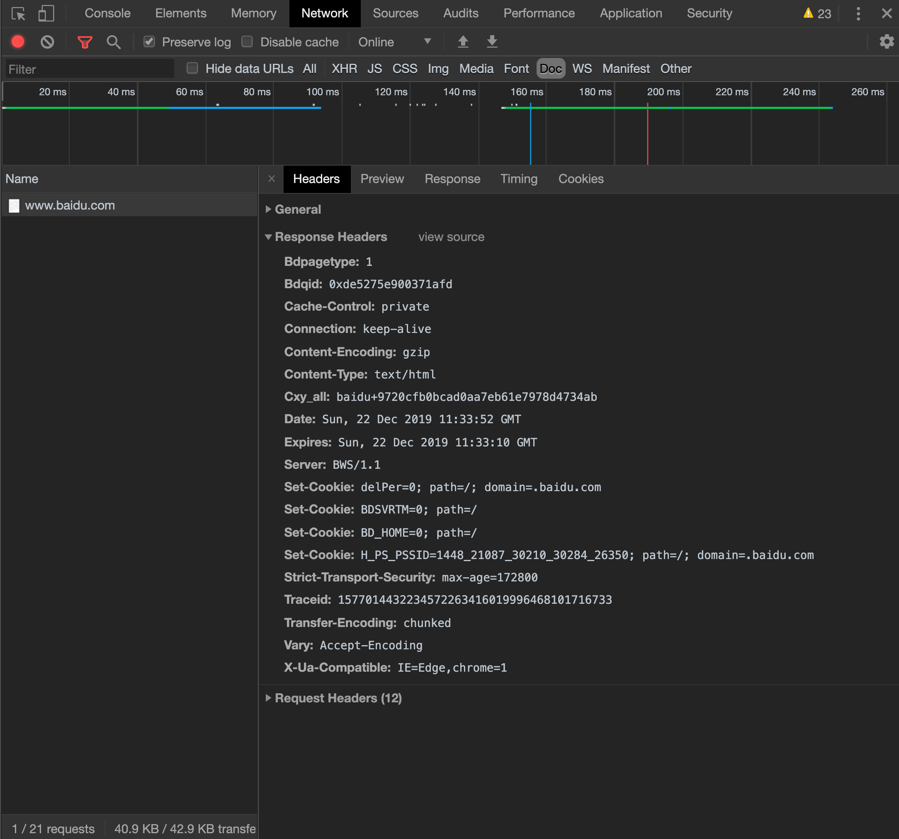
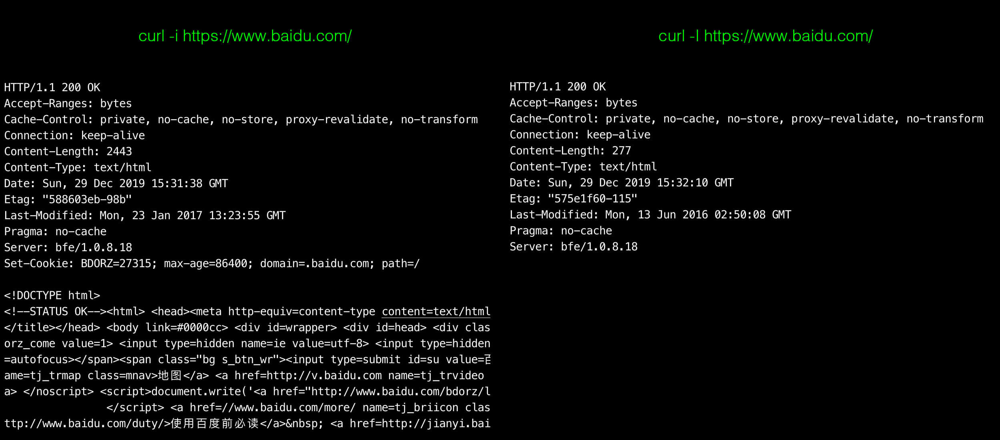

# 了解Http

前面我们大概的说了一下 `Http` 是什么。`Http` 和 `TCP` 的关系。<br>
下面我们来认真了解一下 `Http` 的请求流程。

#### http和TCP的联系

>`http` 属于应用层。`TCP` 属于传输层。`Http` 是建立在 `TCP` 之上。<br>每一个 `HTTP` 的请求都会返回一个 `content-type` ，然后交给渲染进程处理；<br>
`TCP` 负责把东西传输给到 `HTTP` 。
`TCP` 属于负责传送，而 `HTTP` 可以具体到某一件东西，比如我们平常见的 `css` / `image/jpeg` / `text/javascript` 等等

<Br>
<Br>


!>`http` 有以下3个问题：<br>
内容未加密，容易被监听，都是明文传输；<Br>
无法验证内容的完整性，不知道内容有没有被修改过或者容易被篡改；<br>
无法验证对方的身份，无法知道目前对话的人是谁；

#### http的请求流程

* 构建请求
* 查找缓存
* 准备IP地址和端口
* 等待TCP队列
* 建立TCP连接
* 发送HTTP请求

<Br>
<Br>

###### 构建请求

浏览器内部构建请求信息，准备发起网络请求；

```copy
GET /ndex.html HTTP1.1
```

<br>
<br>

###### 查找缓存

在真正发起请求的时候，浏览器会先从本地查找是否有缓存。如果有缓存就会拦截请求，直接读取本地资源。

>读取本地缓存有几个比较好的优势，读取本地缓存可以缓解服务器的压力，可以快速读取资源打开页面。

!>如果本地读取缓存失败了，就会真正的发起请求。

<Br>
<Br>

###### 准备IP地址和端口

说到这里，我们要回顾一下之前我们了解的 `TCP/IP` 协议；<br>
我们知道 `TCP` 的生命周期有三个阶段：`建立链接（三次握手）` 、 `传输数据` 、 `断开连接（四次挥手）`;<br>
服务器在 `传输数据` 阶段会处理 `Http` 的请求，也就是说 `Http` 的内容都是通过 `TCP` 数据传输阶段来实现的。


从上面的图片可以看出，要处理 `Http` 请求的第一步就是和服务器建立 `TCP` 连接；<Br>
要建立 `TCP` 连接，我们必须要知道 `IP地址` 和 `端口号`；<br>
如何获取端口号，我们能不能通过一个 `URL` 地址就知道 `IP地址` 和 `端口号`。<Br>

<b>怎么获取 `URL` 的 `IP地址` 和 `端口号`?</b><br>
要获取 `URL` 的 `IP地址`，这个时候我们就要了解一下什么是 `DNS`。

###### 什么是DNS

```copy
DNS的含义

`DNS` 域名系统（Domain Name System 或 Domain Name Service）
日常中我们访问的每个域名，其实都对应一个 `IP` 地址。这个地址是一串数字，比较难记，所以才有了域名的出现，域名和 `IP` 存在映射关系。
`DNS` 指的是域名和 `IP` 地址相互映射的一个分布式数据库；

`DNS` 解析过程：

* 检查浏览器缓存中是否有该域名对应的IP地址:
>当浏览器浏览过某个网站，浏览器缓存中就会自动缓存这个网站域名对应的地址。用户再次打开这个域名的时候，浏览器就会再次从缓存中找到这个
IP地址。当从缓存中找到这个IP地址，`DNS解析过程` 结束。

* 浏览器中没有找到该IP地址，就会从电脑中查找是否缓存过这个IP地址:
>当从浏览器中没有找到该IP地址，就会从电脑的 `hosts` 文件位置查看是否有将该域名和IP地址做一个绑定；

* 如果浏览器和电脑中都没找到:
>那么系统就会请求本地域名解析服务系统解析；
如果你在校内网，那么你的本地域名解析服务系统就在学校的机房，如果你链接的是电信，那么你的本地域名解析服务系统就由本地区的运营服务商来提供。
```

从上面的流程不断推敲，我们知道要处理 `Http` 请求，我们必须先建立 `TCP` 连接。要建立 `TCP` 连接，必须得先知道 `IP地址` 和 `端口号`。
 `IP地址` 和 `端口号` 我们如何获取呢？

因为 `DNS` ，所以我们可以通过域名映射获得 `IP地址` 。<Br>
一般情况下，`URL` 没有指明端口号的话，默认端口号为 `80` 端口。

<Br>
<Br>

###### 等待TCP队列

已经有了 `IP地址` 和 `端口号`，我们是不是就可以开始 `TCP` 连接了呢？<Br>
不是的，Chrome 机制限制了同一域名下只可以同时建立 `6个` `TCP` 链接。 如果在同一个域名下面同时有10个请求发生的话，有4个就会被挂起等待。直至进行中的请求完成为止。


<Br>
<Br>

###### 建立TCP连接

望穿秋水，到了这一步，终于可以建立 `TCP` 连接了。<Br>
`TCP` 的连接建立需要经过三次握手才能成功。（可以回顾上一个章节的内容）；<br>
`TCP` 的有三个生命周期 `建立链接（三次握手），数据传输，断开链接（四次挥手）`；

<Br>
<Br>

###### 发送HTTP请求

`TCP` 建立连接成功之后就可以传送数据了。

<br>
<br>

#### HTTP请求过程

<b>浏览器是如何发送请求给服务器的？</b>

首先浏览器会想服务器 `发送请求行`，它包括 `请求方法` ，`请求URI和 http 版本协议`。 

我们可以通过 `chrome` 的 `控制面板` - `network` - `doc` 查看服务器的 `请求头` 和 `响应头`；

我们可以选择 `Doc` 查看文档的相关，我们可以看到右边的控制面分别有 `general`，`response headers 响应头` 和 `request headers 请求头` :


<Br>
<Br>

<b>General</b>


```copy
`Request URL` : https://www.baidu.com/  -- 请求的地址
`Request Method`: GET           -- 请求方法
`Status Code`: 200 OK           -- 状态码
`Remote Address`: 182.61.200.6:443          -- 路由地址      
`Referrer Policy`: no-referrer-when-downgrade       -- 来自于哪里
```

<Br>


<b>request headers 响应头</b>


```copy
Accept: text/html           -- 接受的类型
Accept-Encoding: gzip       -- 接受的编码
Accept-Language: en,zh;q=0.9,zh-CN;q=0.8        -- 接受的语言
Cache-Control: max-age=0        -- 缓存控制
Connection:keep-alive       -- 客户端与服务端的链接关系
cookies:BAIDUID=4E109BB4F...        -- 客户端暂存服务端的缓存
Host: www.baidu.com         -- 目标主机和端口号
Cookie：BAIDUID=4E109BB4F304188F84786DFC62E2AE11:FG=1       -- HTTP发送请求的时候会把域名下的所有 COokie 值发送到服务器

```


>`Cache-Control` 有两个值，一个是 `no-cache` ，一个是 `max-age=0` 。<br>
`no-cache` 指的是不管服务端有没有设置 `Cache-Control`，每次都必须从服务端获取请求；<br>
`max-age=0` 指的是在获取资源之前校验 `ETag/Last-Modified`<br>
`Connection` 的 `keep-alive` ；我们需要先了解什么是 `短链接` ，什么是 `长链接`；<br>
`短链接`：指的是每次请求就建立链接。 `创建tcp链接` - `http请求(又分请求资源-响应资源两个阶段)` - `关闭tcp链接` 的过程。<Br>
`长链接`：指的是只建立一次链接，多次资源请求都会服用该链接，完成后关闭。<br>
例如：页面上要请求20张图片，只需要建立一次 `tcp链接`，然后一次请求这20张图片，请求完之后释放（关闭链接）；<br>
我们可以理解 `keep-alive` 就是 `长链接`；

<br>


<b>response headers 响应头</b>



```copy
Strict-Transport-Security：max-age-172800       -- 一个安全功能，它告诉浏览器只能通过HTTPS访问当前资源, 禁止HTTP方式
Date：Sun, 29 Dec 2019 15:05:32 GMT     -- 时间（返回的时间由 General 的 remote 而定，如果返回的是 127.0.0.1 则 Date 指的是本地时间）
Last-Modified：12/29/2019 23:10:23      -- 最后修改时间
Server：BWS/1.1     -- web 软件服务器的名称

```

>我们可以是用 `document.lastModified` 可以查看文档的最后修改时间；<Br>
document.lastModified           // 12/29/2019 23-16-04<br>


<Br>
<Br>


我们可以在 `linux` 通过命令 `curl` 可以查看返回的响应行响应头和响应提的数据，开进一步理解服务器是怎么响应浏览器的。

以网站 `http://www.baidu.com` 为例子，

我们在终端输入以下命令：

```copy
curl -i http://www.baidu.com
```

返回的命令如下：

```copy
<!-- 请求行开始 -->
HTTP/1.1 200 OK         
<!-- 请求行结束 -->

<!-- 请求头开始 -->
Accept-Ranges: bytes
Cache-Control: private, no-cache, no-store, proxy-revalidate, no-transform
Connection: keep-alive
Content-Length: 2381
Content-Type: text/html
Date: Sun, 22 Dec 2019 10:56:04 GMT
Etag: "588604c8-94d"
Last-Modified: Mon, 23 Jan 2017 13:27:36 GMT
Pragma: no-cache
Server: bfe/1.0.8.18
Set-Cookie: BDORZ=27315; max-age=86400; domain=.baidu.com; path=/
<!-- 请求头结束 -->

<!-- 请求体开始 -->
<!-- 请求体结束 -->

<!-- 返回的 content-type 的内容开始 -->
<!DOCTYPE html>
...
<!-- 返回的 content-type 的内容结束 -->

```


```copy
发送请求行：指的是告诉服务器浏览器需要什么资源；
常用的请求方法有 get 和 post 方法
get 方法是常用的请求方法。另一种方法是 post 。它用于发送一些数据给服务器。
```


>`curl -i http://www.baidu.com` 和 `culr -I http://www.baidu.com` 是不一样的：<Br>
`-i` 表示获取响应头和响应行数据，还有响应体数据；<Br>
`-I` 表示只获取响应头和响应行数据，不需要过去响应体数据。

<b>curl -i 和 culr -I 的区别</b>




<Br>
<Br>

#### http和https的区别

>`http` ：是超文本传输协议，信息是明文传输的；<br>
`https` ：在 `http` 上多了一层 `SSL` 的加密传输协议；<br><br>
首先 `https` 是 `http Security` 的简称；<Br>
虽说是 `https` 但是，本质上还是 `http` ；为什么呢？只不过因为 `https` 在传输层多了一步，这一步就是 `加密` ； 

>`http` ：是超文本传输协议，信息是文明传输的；<br>
`https` ：是具有安全性的 `SSL` 加密传输协议；<br><br>

两者是完全不同的连接方式，用的端口也不一样；<br>
`http` 用的是 `80` 端口；<br>
`https` 用的是 `443` 端口；<br><br>
`http` 的链接很简单，是无状态的；<br>
`https` 的链接是由 `SSL+HTTP` 协议构建的，可进行加密传输，身份认证的网络协议要比 `http` 协议安全；

<Br>

!>`明文传输` 指的数据是在计算机中传输并没有经过加密处理。<Br>
`SSL` 指的是 `Secure Socket Layer 安全套接层`；`https` 在提交给传输层（`tcp`）前发生。涉及到 `对称密钥`，`非对称密钥`。
`对称密钥` 就是一对密钥，`非对称密钥` 就有两对密钥，双方各自持有对方的公钥，自己拿着私钥。<br>
`TLS` 指的是 `传输层安全` 是更为安全的升级版 SSL；


<Br>
<Br>


#### TCP数据包丢失和HTTP的渲染关系

<b>`TCP` 传送数据的时候，就已经开始渲染页面了吗？如果数据包丢失，实时渲染的页面怎么呈现？</b><br>

>当 `TCP` 交给应用层，应用层解析 `HTTP` 响应头的 `contnet-type` 类型的时候就开始准备渲染页面了。<br>
数据包是否丢失，是否完整的情况其实不影响实时渲染，因为数据包的完整性是在 `TCP` 阶段就已经通过检验的（ `TCP` 阶段对丢失的数据包有重传机制）； 


#### 总结

<br>
<br>

#### http状态码

|http状态码|详细状态码|状态原因|
|--|--|--|
|1xx||消息|
|2xx||成功|
|3xx||重定向|
|4xx||客户端错误|
|5xx||服务端错误|
|5xx|500|借口报错|
|5xx|502|后端服务没开启|
|5xx|503|启动挂了|


<!-- https://juejin.im/post/5df7959051882512480a83e7?utm_source=gold_browser_extension

https://juejin.im/post/5df8f11df265da33f40f255e?utm_source=gold_browser_extension -->

<!-- https://www.jianshu.com/p/6ba9273692c5 -->