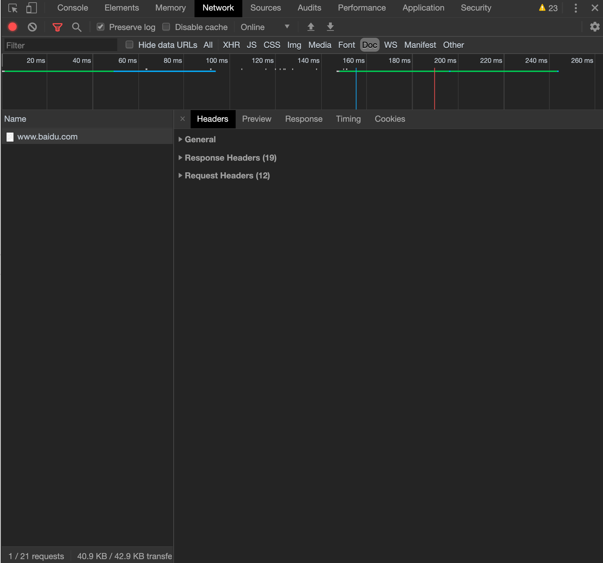
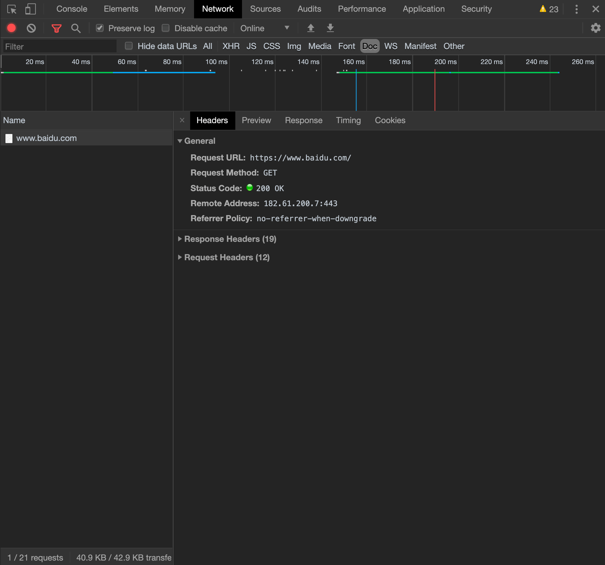
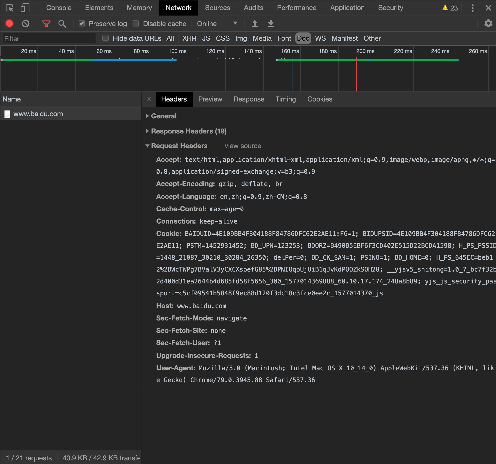
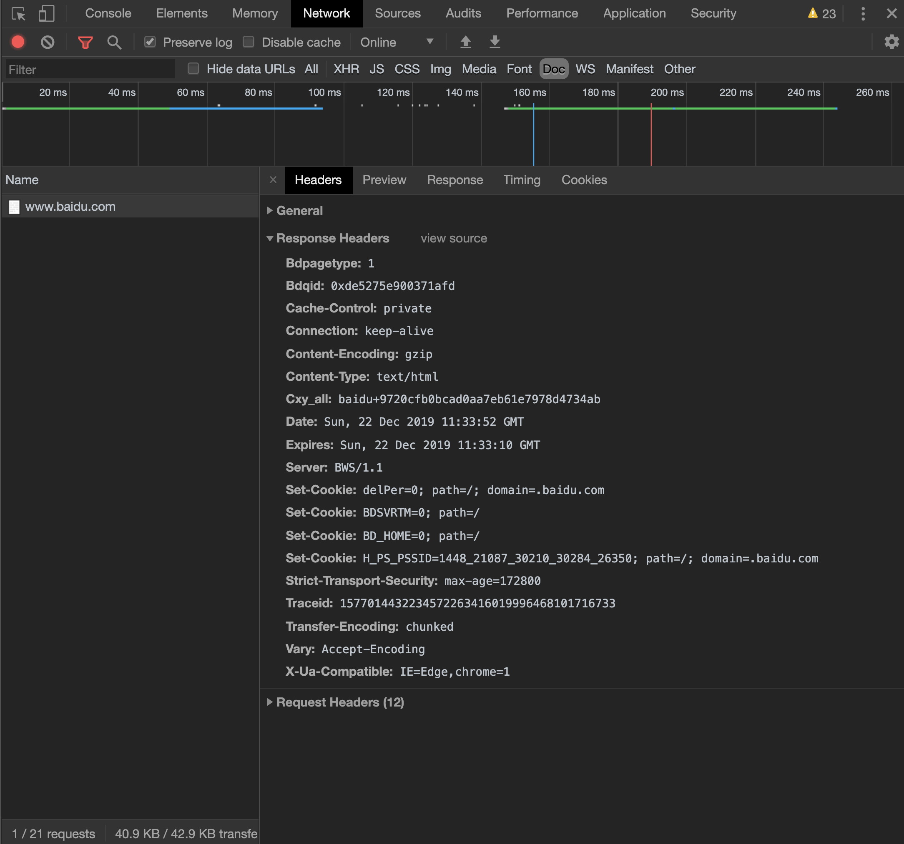

# URL导航过程

面试题我们经常会看到这个问题：<br>
从输入 `URL` 的那一刻发生了什么？


#### 导航栏输入

用户在导航栏输入 `URL` 回车后，浏览器会去判断用户输入的是合法的 `URL` 地址还是搜索内容。
* 如果输入的是合法的 `URL` 地址，则进行下一步；
* 如果输入的是搜索内容，浏览器就会使用默认的搜索引擎进行搜索；
<br>
<br>

#### 查找缓存
接下来浏览器进程会跟网络进程之间进行 `通信（IPC）` ，浏览器进程会把 `URL` 发送到网络进程。网络进程收到 `URL` 之后会发起真正的 `URL` 请求；
在发起请求之前，浏览器会对本地的缓存副本做一次校验。即查看本地有没有缓存。
* 网络进程在会先从本地查找缓存资源。如果本地没有缓存资源，就会直接进入网络请求；

<Br>
<Br>


#### URL请求过程

* 获得 `目标IP` 之后就可以建立 `TCP/IP` 链接了；（<a href="#/network/?id=tcp的链接过程">关于 `TCP/IP` 的连接过程</a>，）
* 连接成功之后，浏览器就会发起请求行，请求头等信息，并且给该域名相关的 `cookie` 附加到请求头中，想服务器发送构建信息。
* 接着网络进程会接受服务器发来的响应行和响应头，并且解析。（如果解析后的响应头状态码为 `301` 或者 `302` ，则会触发响应头的 `location` 字段，进行重定向。）;
* 网络进程解析响应行和响应头之后会告诉浏览器已经收到服务器反馈（网络进程会根据响应头返回的 `content-type` 来区分文件格式。如果请求的 `URL` 是一个下载文件，就会将此文件下载（此时导航结束）。如果是一个 `html` 的话就会告诉浏览器可以进行下一步，继续导航）；

<br>
<br>

<b>服务器怎么处理http的请求的</b>

首先浏览器会想服务器 `发送请求行`，它包括 `请求方法` ，`请求URI和 http 版本协议`。 

```copy
GET /index.html HTTP/1.1
```

<br>
<br>


浏览器还会想服务器发送请求头；服务器接受到请求头之后会返回请求，返回响应头和响应体；

>我们可以通过 `chrome` 的 `控制面板` - `network` - `doc` 查看服务器的 `请求头` 和 `响应头`；<br>
我们可以选择 `Doc` 查看文档的相关，我们可以看到右边的控制面分别有 `general 概要`，`response headers 响应头` 和 `request headers 请求头` :

<br><br>



<Br>
<Br>

<b>General 概要</b>

这部分包含请求方式，状态码，服务器地址以及 `Referrer` 策略。



```copy
`Request URL` : https://www.baidu.com/  -- 请求的地址
`Request Method`: GET           -- 请求方法
`Status Code`: 200 OK           -- 状态码
`Remote Address`: 182.61.200.6:443          -- 路由地址      
`Referrer Policy`: no-referrer-when-downgrade       -- 来自于哪里 (指的是该页面是从哪里跳转过来。)
document.referrer 返回载入当前页面来源文档的URL；

```

<Br>


<b>request headers 请求头</b>



```copy
Accept: text/html           -- 接受的类型
Accept-Encoding: gzip       -- 接受的编码
Accept-Language: en,zh;q=0.9,zh-CN;q=0.8        -- 接受的语言
Cache-Control: max-age=0        -- 缓存控制
Connection:keep-alive       -- 客户端与服务端的链接关系
cookies:BAIDUID=4E109BB4F...        -- 客户端暂存服务端的缓存
Host: www.baidu.com         -- 目标主机和端口号
Cookie：BAIDUID=4E109BB4F304188F84786DFC62E2AE11:FG=1       -- HTTP发送请求的时候会把域名下的所有 COokie 值发送到服务器

```


>`Cache-Control` 有两个值，一个是 `no-cache` ，一个是 `max-age=0` 。<br>
`no-cache` 指的是不管服务端有没有设置 `Cache-Control`，每次都必须从服务端获取请求；<br>
`max-age=0` 指的是在获取资源之前校验 `ETag/Last-Modified`<br>
`Connection` 的 `keep-alive` ；我们需要先了解什么是 `短链接` ，什么是 `长链接`；<br>
`短链接`：指的是每次请求就建立链接。 `创建tcp链接` - `http请求(又分请求资源-响应资源两个阶段)` - `关闭tcp链接` 的过程。<Br>
`长链接`：指的是只建立一次链接，多次资源请求都会服用该链接，完成后关闭。<br>
例如：页面上要请求20张图片，只需要建立一次 `tcp链接`，然后一次请求这20张图片，请求完之后释放（关闭链接）；<br>
我们可以理解 `keep-alive` 就是 `长链接`；

<br>


<b>response headers 响应头</b>



```copy
Strict-Transport-Security：max-age-172800       -- 一个安全功能，它告诉浏览器只能通过HTTPS访问当前资源, 禁止HTTP方式
Date：Sun, 29 Dec 2019 15:05:32 GMT     -- 时间（返回的时间由 General 的 remote 而定，如果返回的是 127.0.0.1 则 Date 指的是本地时间）
Last-Modified：12/29/2019 23:10:23      -- 最后修改时间
Server：BWS/1.1     -- web 软件服务器的名称

```

>我们可以是用 `document.lastModified` 可以查看文档的最后修改时间；<Br>
document.lastModified           // 12/29/2019 23-16-04<br>


<Br>
<Br>


我们可以在 `linux` 通过命令 `curl` 可以查看返回的响应行响应头和响应提的数据，开进一步理解服务器是怎么响应浏览器的。

以网站 `http://www.baidu.com` 为例子，

我们在终端输入以下命令：

```copy
curl -i http://www.baidu.com
```

<br><br>

返回的命令如下：

```copy
<!-- 请求行开始 -->
HTTP/1.1 200 OK         
<!-- 请求行结束 -->

<!-- 请求头开始 -->
Accept-Ranges: bytes
Cache-Control: private, no-cache, no-store, proxy-revalidate, no-transform
Connection: keep-alive
Content-Length: 2381
Content-Type: text/html
Date: Sun, 22 Dec 2019 10:56:04 GMT
Etag: "588604c8-94d"
Last-Modified: Mon, 23 Jan 2017 13:27:36 GMT
Pragma: no-cache
Server: bfe/1.0.8.18
Set-Cookie: BDORZ=27315; max-age=86400; domain=.baidu.com; path=/
<!-- 请求头结束 -->

<!-- 请求体开始 -->
<!-- 请求体结束 -->

<!-- 返回的 content-type 的内容开始 -->
<!DOCTYPE html>
...
<!-- 返回的 content-type 的内容结束 -->

```


```copy
发送请求行：指的是告诉服务器浏览器需要什么资源；
常用的请求方法有 get 和 post 方法
get 方法是常用的请求方法。另一种方法是 post 。它用于发送一些数据给服务器。
```


>`curl -i http://www.baidu.com` 和 `culr -I http://www.baidu.com` 是不一样的：<Br>
`-i` 表示获取响应头和响应行数据，还有响应体（正文）数据；<Br>
`-I` 表示只获取响应头和响应行数据，不需要过去响应体（正文）数据。

<b>curl -i 和 culr -I 的区别</b>


<Br>
<Br>
<br>
<br>

#### 准备渲染

* 浏览器接收到网络进程的通知后，就会告诉网络进程把接收到的 `html` 递交给渲染进程准备渲染。
* 渲染进程接收到网络进程的 `html` 后，就会跟浏览器说我已经接收到 `html` 了，确认 `提交文档` 。
* 浏览器接受到渲染进程的通知后，更新浏览器:导航的 `URL` 地址,前进后退状态，更新 web 页面。

<br>
<br>

#### 开始渲染

* 浏览器刷新状态和前进后退历史，和导航 `URL` 之后，便开始渲染和资源加载了。 


#### TIPS

* 有的时候我们会看到 `a` 链接上会有属性 `rel="noopener noreferrer"` ，这个的意思是新打开的子窗口不需要访问父窗口的任何内容，这是未了防止钓鱼网站窃取父窗口的信息。对这样的属性，一般都会新建一个渲染进程。

