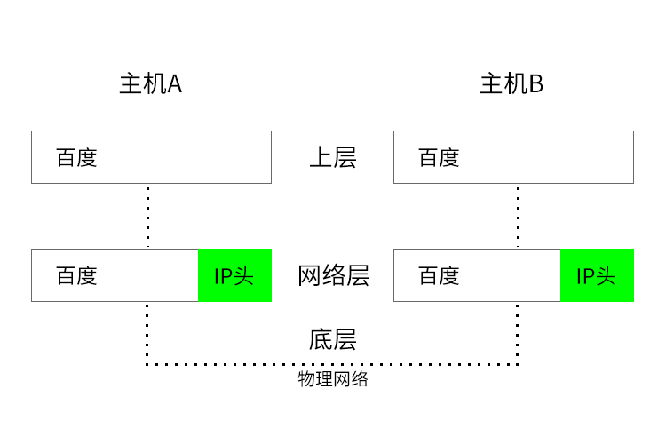
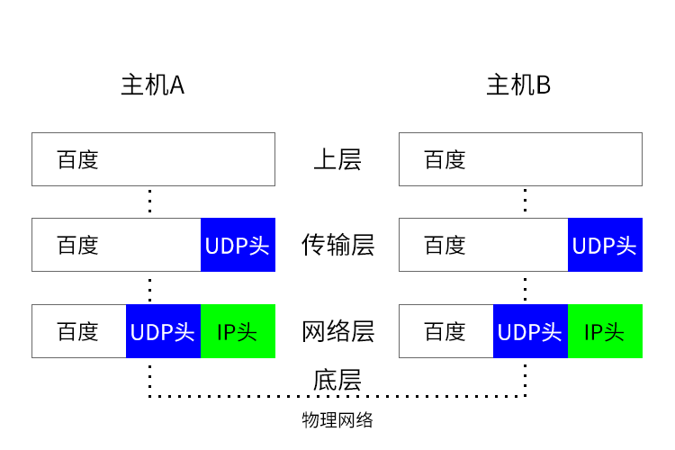
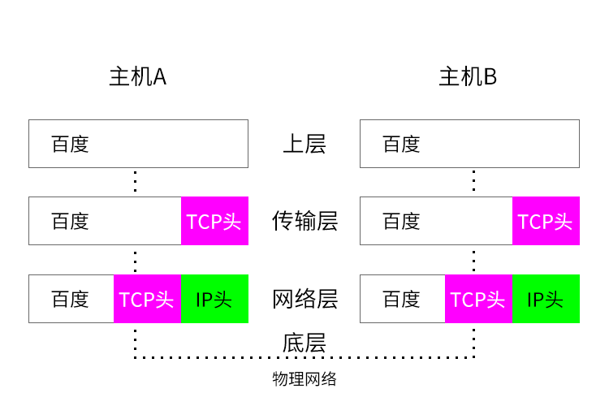

# 了解TCPIP协议

我们常见的网络协议可分为： `七层网络协议`，`TCP / IP协议`

#### OSI七层网络协议
应用层：FTP，WWW，Telnet，NFS，SMTP，Gateway，SNMP 
表示层：TIFF，GIF，JPEG，PICT，ASCII，EBCDIC，encryption，MPEG，MIDI，HTML 
会话层：RPC，SQL，NFS，NetBIOS，names，AppleTalk，ASP，DECnet，SCP 
传输层：TCP，UDP，SPX 
网络层：IP，IPX，AppleTalk DDP 
数据链路层：Frame Relay，HDLC，PPP，IEEE802.3 / 802.2，FDDI，ATM，IEEE802.5 / 802.2 
物理层：EIA / TIA - 232，EIA / TIA - 499，V.35，V.24，RJ45，Ethernet，802.3，802.5，FDDI，NRZI，NRZ，B8ZS

 

<b>今天我们主要来讲一下 `TCP/IP` 协议；</b>

#### TCPIP协议

`TCP/IP协议` 分四层，每一层都要求它下面的一层来满足它的需求。 

应用层：Http，elnet，FTP，SMTP，SNMP 
传输层：TCP，UDP，UGP 
网络层： IP，ICMP，IGMP 
数据链路层：ARP，RARP

#### 各个层的功能
应用层：提供用户程序接口 
传输层：提供传输顺序信息与响应 
网络层：提供数据通过的路由 
数据链路层：进行数据打包与解包，形成信息帧 
物理层：实现计算机系统与网络间的物理连接 
会话层：建立和中止连接 
表示层：数据转换、确认数据格式 

#### 什么是TCPIP协议

`TCP/IP协议` 更准确来说，它是一个统称；它包含了 `IP协议`，`TCP协议`，`Http协议`，`Ftp协议`等等。

网络协议本来就是一个大的体系，我们要弄清楚它不是一件容易的事情，这里我们主要来了解一下 `一个主机的数据是怎么安全到达到对方的主机上的`。

互联网上的数据是通过数据包来传输的，如果数据很大的话，会被拆分为多个小数据包传输。比如我们平常看到的视频，听到的音乐等等都是通过多个小数据包来传输过来的。

#### 什么是CDN

`CDN` 分发网络（Content Delivery Network）； 
>`CDN` 的原理是广泛的用各种缓存服务器，然后将这些服务器放在用户访问相对集中的区域或者网络中，那么用户在访问的时候，利用全局负载技术奖用户的访问指向最近的服务器；

#### 什么是IP

`IP`：Internet Protocol，网际协议；

`IP`：网际协议（Internet Protocol，简称 IP），可以理解为计算机的地址； 
我们数据要在网络上传输，需要基于网际协议传输。互联网上每一件设备都有它自己的地址，而这个地址是唯一的。有了这个地址，计算机之间就可以互相往来通信，传输数据包。

>`IP`地址好比是你的家庭地址，有了你的家庭地址你就可以跟别人寄送包裹和接受包裹。

 
 

一个数据包从 `主机A` 传送到 `主机B` ，那么在传输之前，数据包会附加上一个 `IP头` 。这个 `IP头` 的数据结构 `IP地址信息` ， `IP版本` 等等。

>`IP头` 数据结构里有 `主机A` 和 `主机B` 的 `IP地址信息` ，有了这个 `IP地址信息` ，数据包才能够送到到 `主机B` ， `主机B` 才能回复`主机A` 。

 

<b>`IP` 传数据包的过程：</b>

* `主机A` 的 `上层` 将数据包交给网络层进行传输；
* 网络层将 `IP头` 附加到数据包上，称为 `IP数据包` ， 然后转交给 `底层` ；
* `底层` 通过物理网络将数据包传输到 `主机B` 的网络层；
* `主机B` 的网络层把 `IP数据包` 进行拆分，把 `IP头` 留下，将数据交给 `主机B` 的 `上层` ；

 

>`IP` 地址可以确保双方可以互相访问； 

 
 

#### 什么是UDP

`UDP`：User Datagram Protocol，用户数据包协议；

`UDP` 负责把数据包送达到应用程序；

刚才我们说的 `IP` 只负责把数据包从 `主机A` 传送到 `主机B` 。但是 `主机B` 只接收了数据包，并不知道要把数据包发给哪个应用程序。这个时候，就有了能够和应用程序沟通的协议，这就是 `用户数据包协议` ，简称 `UDP` ；  

`UDP` 有一个强大的强大的功能，它能够识别端口号，每一个想访问网路的应用实例都有一个端口号，通过端口号， `UDP` 就能把数据包送达到指定的应用程序。 

 

<b>`UDP` 传数据包的过程：</b>

* `主机A` 的 `上层` 将数据包交给传输层；
* 传输层会把 `UDP头` 附加在这个数据包上，形成 `UDP数据包` ，再将 `UDP数据包` 交给网络层；
* 网络层结果 `UDP数据包` 之后再附加一个 `IP头` 形成新的 `IP数据包` ，再交给底层；
* 底层通过物理网络传输，将数据包发送到 `主机B` ；
* `主机B` 的网络层拆分 `IP头` ，变成了 `UDP数据包` ，交给了传输层；
* 传输层的 `UDP头` 识别出了端口号，告知要把数据包交给哪个对应的应用程序；

 

>`UDP` 可以识别端口号把数据包交给对应的应用程序，速度快，但是缺少完整性； 

  

在数据的传输过程当中，有各种因素导致数据包不能够完整的送达。虽然 `UDP` 可以知道要把数据分发到哪个应用程序，但是在数据包丢失的情况下，它并没有重发机制，并且 `UDP` 也不知道数据包有没有完整到达目的地；

!>`UDP` 不能保证数据的可靠性，但是它的传输速度很快，所以一般来说，`UDP` 被一些对数据完整性并不那么重视的项目采纳，比如视频，音频，互动游戏等等。 
`UDP` 并不是面向链接的， `UDP` 在传输前并不确认链接关系

####  什么是TCP

`TCP`: Transmission Control Protocol，传输控制协议； 
`TCP` 负责把数据包 `完整` 的送达到应用程序； 
上面我们知道了 `UDP` 只是把数据包交给应用程序，但是它并不保证数据的完整性。 `TCP` 就弥补了这个缺陷。 

 

相对于 `UDP` ， `TCP` 有以下特点： 
>对于丢失的数据包，`TCP` 触发重发机制，保证数据的完整性； 
`TCP` 引入序列机制，保证乱序的数据包能够正确排列；

 

<b>`TCP` 传数据包的过程：</b>

* 跟 `UDP` 的传输流程一样，`主机A` 上层会把数据包提交给传输层；
* 传输层拿到数据包后会附加上 `TCP头` ，然后将 `TCP头` 交给网络层；
* 网络层会附加上 `IP头` ，并且提交到底层；
* 底层通过物理网络然后传送到 `主机B` 的网络层；
* 网络层把数据包的 `IP头` 分解开，然后提交给传输层；
* 传输层通过 `TCP` 识别应用端口号，把数据包下发到对应的应用程序；

 

>`TCP` 可以识别端口号把数据包交给对应的应用程序，有序列号机制，保证数据包的排列顺序；数据包丢失触发重传机制，具有完整性； 缺点是速度没有 `UDP` 快； 

#### TCP的链接过程

我们来了解一下 `TCP` 是怎么触发重发机制，确保数据的完整性，了解序列号机制，怎么保证数据包的排列顺序； 

`TCP` 的生命周期包括：`建立连接`，`传输数据`，`断开连接` 三个阶段；

 

###### 建立连接

>这里是通过 `三次握手` 来确定连接关系的； 
`三次握手` 主要是客户端和服务端一共要发送三个数据包来确认连接关系； 
* 客户端发送一个请求包给服务器等待服务器确认（第一次握手）； 
【你好，我给你发送了一个包裹，你那边可以收到吗（第一次握手）】 
 
* 服务器收到这个包之后，想服务端也发起一个结果告诉客户端已经收到该包（第二次握手）； 
【你好，我这边收到了你的包裹（第二次握手）】 
 
* 客户端收到来自服务器的结果之后，向服务器发送确认（第三次握手）； 
【好的（第三次握手）】

 

!>为什么不是两次握手？ 
因为两次握手的话，主机B会一只等待主机A的回应，会造成性能上的损害，所以不能两次握手。

###### 传输数据

>这个阶段，在传输数据的时候，接收端需要对每个数据包进行确认操作，就是接收端接收到数据包之后，需要向发送端发送确认消息； 
所以当发送发送数据包之后，没有接收到接收端的回馈，发送端会把它默认为数据包丢失，会重新传一遍，此触发重发机制； 
一个大的数据包会被拆分为许多小小的数据包，数据包到达接收端之后，会按照 `TCP` 的序号进行排序，从而保证了数据的完整性和序列性；

 

###### 断开连接

>数据传送完毕之后，断开连接，这里会涉及到 `四次挥手` ； 
 
>客户端请求断开连接（第一次挥手）; 
【你好，我要断开连接了（第一次挥手）】  
服务端收到请求，发送确认信号（第二次挥手）和操作确认信号（第三次挥手）； 
【好的，我收到请求了（第二次挥手）；我已经断开啦（第三次挥手）】  
客户端回应服务端的操作信号（第四次挥手）； 
【好的，谢谢你（第四次挥手】

 
 

#### TCP和UDP的区别

那么 `TCP` 和 `UDP` 之间有什么区别呢?

>1、`基于连接` 与 `无连接` ;  `UDP` 是 `无连接` 的，即发送数据之前不需要建立连接 
2、`TCP` 保证数据正确性，`UDP` 可能丢包，`TCP` 保证数据顺序，`UDP` 不保证。 
也就是说，通过 `TCP` 连接传送的数据，无差错，不丢失，不重复，且按序到达; 
`UDP` 尽最大努力交付，即不保证可靠交付 `Tcp` 通过校验和，重传控制，序号标识，滑动窗口、确认应答实现可靠传输。 
如丢包时的重发控制，还可以对次序乱掉的分包进行顺序控制。 
3、`UDP` 具有较好的实时性，工作效率比 `TCP` 高，适用于对高速传输和实时性有较高的通信或广播通信。 
4、每一条 `TCP` 连接只能是点到点的； `UDP` 支持一对一，一对多，多对一和多对多的交互通信。 
5、`TCP` 对系统资源要求较多，`UDP` 对系统资源要求较少。 

 
 

#### TCP与多标签窗口

<b>现代浏览器可以同时打开很多标签，端口都是一样的吗？数据怎么知道去到哪个标签页？</b> 

>端口号都是一样的，当浏览器拿到数据之后，网络进程会将 `TCP链接` 交给对应的标签页， 然后会把数据分发给对应的渲染进程；

 
 