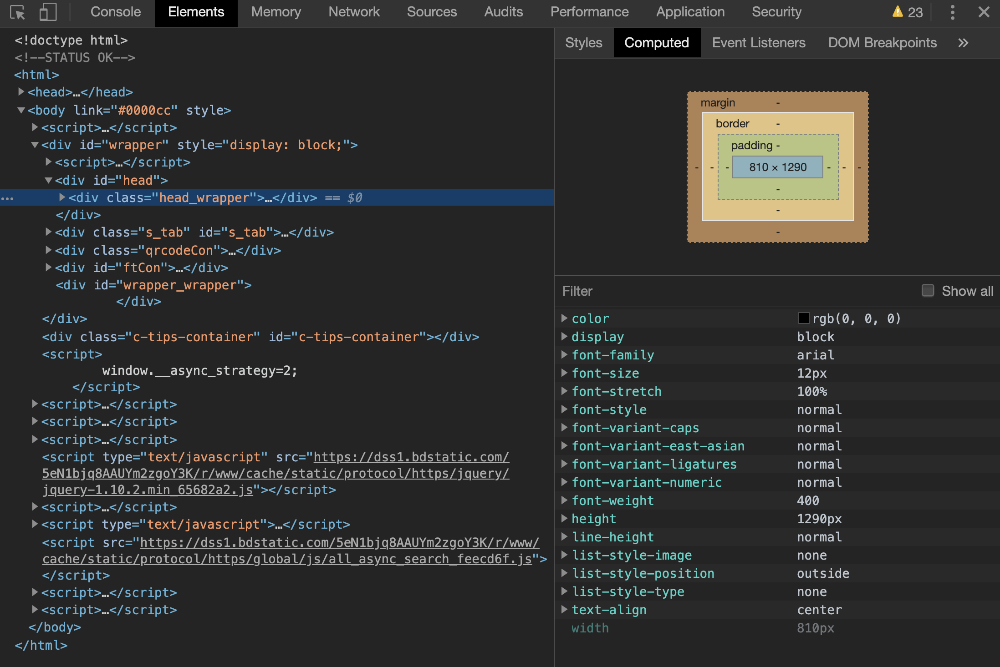

# 页面渲染过程

当渲染进程 `提交文档` 给浏览器之后，浏览器便开始渲染页面和加载资源。

页面渲染的过程(按照时间顺序)大致分为以下几点：<br>
* 构建 `dom树`；
* 构建 `cssom` （计算css样式），属性值转换成渲染引擎能够读懂的内容；
* `dom树` 和 `cssom` 合并形成 `渲染树（render tree）` 计算 `dom元素` 的几何位置；
* 根据 `render tree` 创建 `布局树` ；
* 根据 `布局树` 进行分层，生成 `分层树` ；
* 为每个 `分层` 生成绘制列表，提交到主线程；
* 主线程合成图块，在删格化线程池中将图块转换成位图；
* 合并线程发送命令给浏览器；
* 浏览器得到消息生成页面，并且显示在显示器上；


#### 构建dom树

什么是 `dom树` ？<Br>
`dom树` 指的是将一个 `html` 文件解析成浏览器可以识别的结构，最终输出树状结构的 `dom`；


我们打开浏览器的 `控制台` - `console` ，输入 `document` 后回车。我们可以看到控制台输出一个完整的 `dom` 结构。 `dom` 结构与我们 `html` 的内容是一模一样的。
但是不同的是，`dom` 是保存在内存中的树状图结构，可以用 `JS` 来查询或者修改 `dom` 的内容。

<br>

比如你要获取 `html` 的内容，我们可以在 `控制台` - `console` 输入：
(以 https://www.baidu.com/ 为例)

```copy
document.documentElement
```
<br>

输出结构为：

```copy
<html>
    <header>...</header>
    <body link="#0000cc" style>...</body>
</html>
```


#### 构建cssom

什么是 `cssom`?<br>
`构建cssom` ，其实就是计算 `css` ;<br>
<Br>

<b>一般我们 `css` 的来源有三个途径：</b>
* 通过 `<link>` 标签引入的 `css文件` ；
* 在 `<style>` 标记内的 `css` ；
* 在元素中的 `style` 属性中的 `css` ；

<br>

就跟 `html` 一样，浏览器无法直接理解这些文件， `css` 需要转换成浏览器能够识别的结构。
这个就是 `styleSheet` 。<br><br>

我们可以通过 `控制台` - `console` 来查看 `cssom` 的结构：
(以 https://www.baidu.com/ 为例)

```copy
document.styleSheets
```

<br>

输出结构为：

```copy
StyleSheetList {0: CSSStyleSheet, 1: CSSStyleSheet, 2: CSSStyleSheet, 3: CSSStyleSheet, 4: CSSStyleSheet, 5: CSSStyleSheet, 6: CSSStyleSheet, 7: CSSStyleSheet, length: 8}
```

<br><Br>

这个 `styleSheets` 会把我们刚才说的三种 `css` 途径来源一起输出出来。<br>
同样，这个 `styleSheets` 也具备来查询和修改的功能。<br><br>

接下来，渲染进程还会进一步处理这个 `styleSheets` 。在 `css` 中有一些相对的单位和一些语意化的属性值（比如说 `rem` ，`em` ， `red` ，`bold` 等等）并不能很好的让渲染引擎理解，所以需要将这些转换成渲染引擎容易理解的值。

```copy
color:red;            -->       color:rgb(255,0,0);
font-size:1rem;       -->       font-size:100px;
font-weight:bold;     -->       font-weight:700;
```

<br><br>
将 `styleSheets` 换算成渲染引擎能够理解的值之后， `cssom tree` 和 `dom tree` 会相结合。`cssom tree` 和 `dom tree` 相结合之后，会计算 `dom tree` 中每个节点的具体样式。 

>在 `dom` 节点中，有些属性是具有继承性质的，比如 `font-size` ，`color` 等等。 `cssom tree` 和 `dom tree` 相结合后会对这些属性的具体样式进行计算。 要了解每个 `dom` 节点的具体样式，只需要在 `控制台` - `elements` 的选项下的 `computed` 便可以查询到该 `dom` 元素的具体样式。



<br><br>

#### 布局

计算完每个元素的具体样式之后，接下来 `cssom tree` 和 `dom tree` 合并来计算 `dom` 元素的几何位置，这个过程我们称之为 `布局`；

计算出元素的几何坐标位置之后，会保存在布局树中。

<br><br>

#### 分层

我们有来布局树，还不能马上执行叶脉你的绘制。


<Br>
<Br>

#### TIPS

<b>`css` 会阻塞 `dom tree` 的合成吗，会阻塞页面的显示吗</b>

`css` 有时候会阻塞页面的

